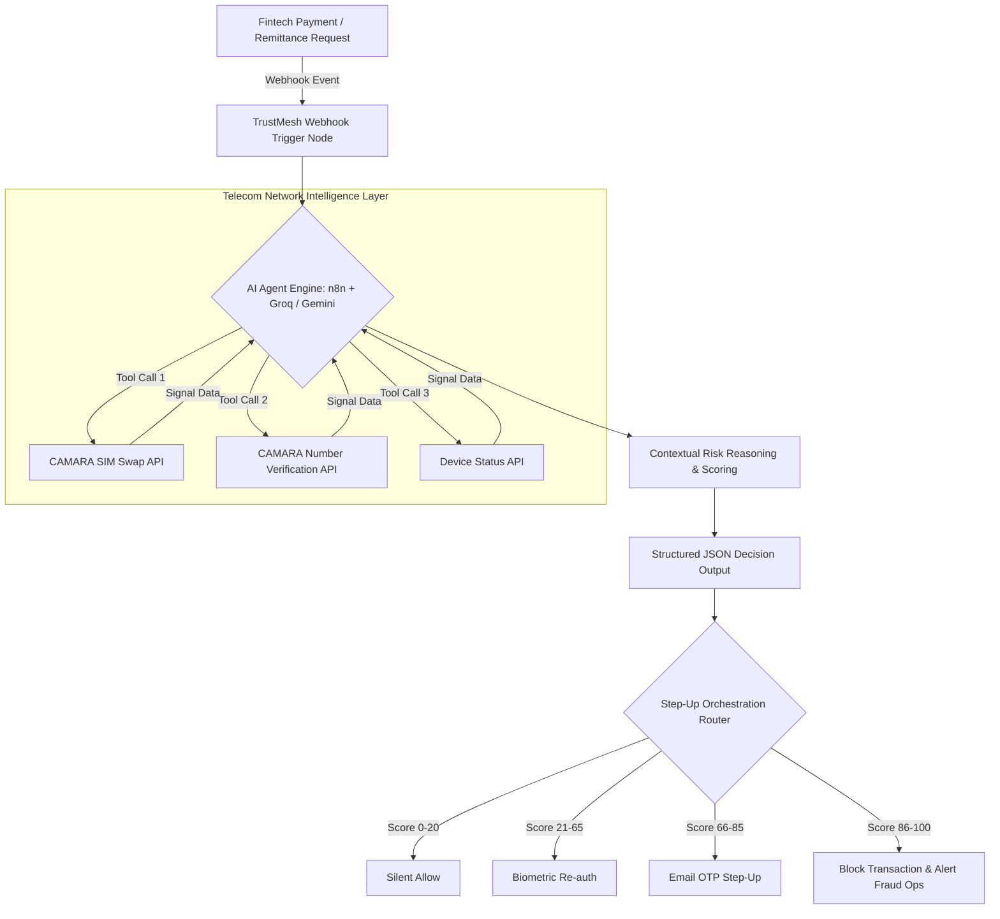

# 🛡️ TrustMesh: AI-Agent Orchestration of Telecom Network Signals for Real-Time Fraud Defense

[](https://www.hackerearth.com/community/challenges/hackathon/mena-ignite-hackathon/)
[]()
[](https://networkascode.nokia.io/)
[]()

> **TrustMesh** bridges the critical gap between telecom network intelligence and financial fraud prevention. By leveraging GSMA Open Gateway CAMARA APIs through an LLM-powered AI agent, TrustMesh detects telecom-layer attack vectors (such as SIM Swap fraud) in real time—protecting digital payments and cross-border remittances across the MENA region.

---

## 📌 Problem Statement

SIM swap fraud is one of the most damaging attack vectors targeting digital financial services across the Middle East & North Africa (MENA) region:
* **$6.7 Billion** lost globally to OTP and account takeover fraud.
* **43% Increase** in scam attempts year-over-year in the UAE (IDEMIA 2026).
* **62% of UAE Banks** report annual fraud losses exceeding $5M USD each (BioCatch).
* **$39 Billion Market:** The UAE cross-border remittance corridor is expanding rapidly toward $50B by 2031, making high-value SMS-authenticated remittance transactions prime targets for SIM hijacks.

**The Blind Spot:** Traditional fraud engines analyze application-layer behavior and device fingerprints, but are completely blind to telecom network events. If a fraudster swaps a victim's SIM card 2 hours before initiating a transfer, application-layer systems cannot see it until the funds are already gone.

---

## 🚀 The TrustMesh Solution

TrustMesh introduces an **AI Agent Layer** that autonomously queries, synthesizes, and acts upon telecom network signals before a transaction is authorized.



### Key Differentiators
* **Contextual Reasoning over Hardcoded Rules:** Rather than binary "if swapped, block" rules, the AI agent evaluates the context (transaction amount, device change history, SIM swap recency) to avoid unnecessary friction for legitimate users.
* **Explainable AI Decisions:** Every decision outputs a 0–100 risk score paired with a natural-language explanation for auditability and compliance.
* **200ms Latency:** Embedded seamlessly into real-time transaction processing pipelines.

---

## 📡 CAMARA APIs Utilized (Nokia Network-as-Code)

TrustMesh orchestrates three standardized CAMARA APIs via the Nokia Network-as-Code simulator:

| CAMARA API | Signal Provided | Purpose in TrustMesh |
| :--- | :--- | :--- |
| **SIM Swap** | Timestamp of last SIM swap, recency status | Identifies recent SIM card swaps indicating account takeover risk |
| **Number Verification** | Phone number match/mismatch status | Confirms the active transaction device matches the registered subscriber |
| **Device Status** | Connection status, roaming, last device change | Detects if the subscriber's phone number was activated on a new device |

---

## 🛠️ Technology Stack & Compliance

All AI agent tools used in TrustMesh strictly comply with the **GSMA MENA AI Resource & Tooling Guide**:

* **Orchestration Layer:** [n8n](https://n8n.io/) (Community Edition, self-hosted visual workflow builder with native AI Agent nodes).
* **AI Reasoning Brain:** [Groq](https://groq.com/) (Llama 3.3 70B for fast sub-200ms inference) with [Google Gemini Flash](https://aistudio.google.com/) as an automated fallback.
* **Network Intelligence:** Nokia Network-as-Code (NaC) Developer Portal (CAMARA API endpoints).
* **Integration:** Event-driven REST Webhook input & JSON output.

---

## 📊 Risk Scoring Framework

| Signal Combination | Risk Score | Recommended Action |
| :--- | :---: | :--- |
| **All Clear:** No recent swap, number match, stable device | `0 - 20` | Silent Allow |
| **Minor Anomaly:** Old SIM swap (>30 days), no device change | `21 - 40` | Allow with Audit Logging |
| **Moderate Concern:** Recent device change, number matches | `41 - 65` | Step-Up: Biometric Re-authentication |
| **High Concern:** Recent SIM swap (<24h) + device mismatch | `66 - 85` | Step-Up: Out-of-Band Email OTP |
| **Critical:** Recent SIM swap + number mismatch + new device | `86 - 100` | Block Transaction & Flag for Fraud Ops |

---

## 📁 Repository Structure

```
TrustMesh/
├── TrustMesh_Idea_Capture_Template.docx  # Phase 1 Submission Document
├── TrustMesh_Pitch_Deck.pptx             # Phase 1 Pitch Deck Presentation
├── TrustMesh_Technical_Architecture.docx # In-depth System Architecture Spec
├── hackathon_page.json                   # Hackathon Guidelines Snapshot
├── .gitignore                            # Git Ignore configuration
└── README.md                             # Project Overview & Documentation
```

---

## 🏆 Hackathon Details

* **Hackathon:** GSMA MENA Ignite Hackathon 2026
* **Primary Theme:** Theme 4 — Secure Fintech, Payments & Anti-Fraud Innovation
* **Participant:** ATHIRA ANIL KUMAR (Full-Stack & AI Engineer)
* **Team Name:** TrustMesh Security
* **Target Showcase:** MWC Doha (November 2026)

---

## 📜 License

Distributed under the MIT License. See `LICENSE` for more information.
